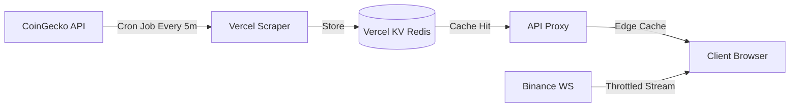

<div align="center">

# ⚡ CryptoPulse
Your high-performance, real-time cryptocurrency trading terminal & portfolio tracker.<br>
Built with ❤️ using React 19, Tailwind v4 & Vite 6

[](https://reactjs.org/)
[](https://www.typescriptlang.org/)
[](https://vitejs.dev/)
[](https://tailwindcss.com/)
[](https://opensource.org/licenses/MIT)

</div>

---

## 📖 Overview

**CryptoPulse** is a professional-grade cryptocurrency tracking, analytics, and portfolio management terminal. Designed to mimic the high-performance interfaces used by enterprise traders, it leverages modern Web APIs and Vercel's Edge infrastructure to deliver real-time market intelligence without dropping frames.

Whether you're tracking whale movements, analyzing charts via TradingView, or monitoring your Web3 portfolio, CryptoPulse brings enterprise-level tools into one seamless, PWA-installable dashboard.

---

## ✨ Features

-  **🚀 Enterprise Scaling Architecture**: Uses Vercel Cron Scrapers and Vercel KV (Redis) to bypass API rate limits and serve data via global Edge Caching.
-  **⚡ Real-Time Price Streaming**: Live ticker updates via Binance WebSockets with **1s Throughput Throttling** to ensure smooth UI performance under high volatility.
-  **📡 Smart Money Radar**: Real-time tracking of large-cap whale transactions (> $5M) across multiple blockchains.
-  **📈 TradingView Integration**: Interactive, professional-grade candlestick charts for technical analysis on every asset.
-  **👛 Web3 Portfolio Tracking**: Connect your Ethereum/Web3 wallet via ethers.js to monitor balances and PkL in real-time.
-  **🧠 AI Market Analysis**: Integrated Google Gemini AI to analyze market trends and provide instant sentiment reports.
-  **📲 Progressive Web App (PWA)**: Fully installable to your mobile device or desktop homescreen with offline asset caching.
-  **🔔 Smart Background Alerts**: Dedicated Web Workers evaluate price alerts off-thread and trigger native OS push notifications.

---

## 🛠️ Tech Stack & Architecture

- **Frontend**: React 19, Vite 6, Zustand
- **Styling**: Tailwind CSS v4 (Modern, utility-first)
- **Data Persistence**: Vercel KV (Redis) + LocalStorage
- **Infrastructure**: Vercel Serverless Functions + Vercel Cron Jobs
- **Analytics**: Recharts, Lightweight Charts, TradingView Widgets
- **Wallets**: Ethers.js v6

### 🧠 System Architecture

CryptoPulse uses a "Scrape & Cache" architecture to ensure 100% uptime and zero rate-limiting errors.



---

## 🚀 Getting Started

### Prerequisites

- Node.js (v18.0.0 or higher)
- A Vercel Account (for KV and Serverless features)

### Installation Steps

1. **Clone the repository**
   ```bash
   git clone https://github.com/AliHCode/CryptoPulse.git
   cd CryptoPulse
   ```

2. **Install dependencies**
   ```bash
   npm install
   ```

3. **Configure Environment Variables**
   Create a `.env` file for Vercel KV and API keys:
   ```bash
   KV_REST_API_URL=your_vercel_kv_url
   KV_REST_API_TOKEN=your_vercel_kv_token
   WHALE_ALERT_API_KEY=your_key (optional)
   VITE_GEMINI_API_KEY=your_key
   ```

4. **Start the development server**
   ```bash
   npm run dev
   ```

---

## 📝 License

Distributed under the MIT License. See `LICENSE` for more information.

---

<div align="center">
  <b>Built by <a href="https://github.com/AliHCode">AliHCode</a></b>
</div>
